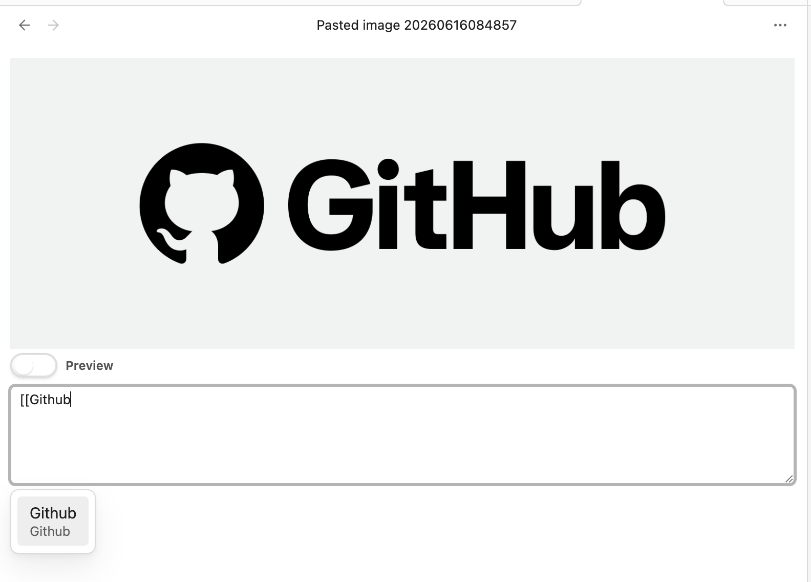
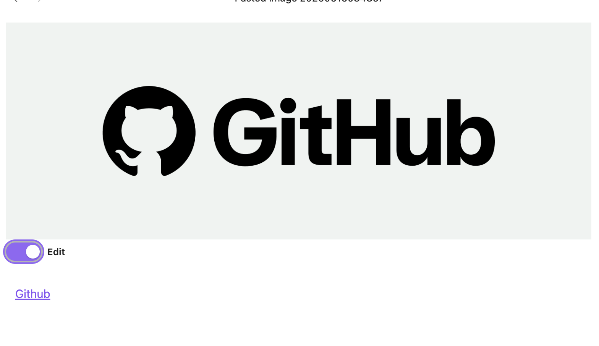

# Image Markdown Description

An [Obsidian](https://obsidian.md) plugin that lets you edit a description for image files (PNG / JPEG) as Markdown and persist it as image metadata.

When you open an image file inside your vault, the plugin renders a small editor below the image. The text you type there is saved directly into the image file:

- **PNG**: stored as a `tEXt` chunk (`Description` keyword)
- **JPEG**: stored in EXIF (`ImageDescription`)

Because the description lives in the image itself, it stays with the file even when you move it outside of Obsidian.

## Features

- Inline description editor shown directly under the image view
- Markdown rendering of the description with a one-click switch between **edit mode** and **preview mode**
- Internal link auto-completion (`[[note name]]`) while editing
- Clicking an internal link in preview mode opens the linked note (`Cmd` / `Ctrl` for a new pane)
- Auto-save on blur (no extra command needed)

## Supported formats

| Format | Storage | Notes |
| --- | --- | --- |
| `.png` | `tEXt` chunk with `Description` keyword | Existing chunks are preserved |
| `.jpg` / `.jpeg` | EXIF `ImageDescription` | Rolls back on partial write failure |

Other file types are ignored — the plugin will not even read the file bytes for unsupported formats.

## Installation

### From the Community Plugins browser (after release)

1. Open Obsidian → **Settings** → **Community plugins**
2. Disable **Restricted mode** if it is on
3. Click **Browse** and search for *Image Markdown Description*
4. Install and enable it

### Manual install

1. Download `main.js`, `manifest.json`, and `styles.css` from the latest [GitHub Release](https://github.com/satojin219/obsidian-image-md-description-plugin/releases)
2. Copy the three files into `<your vault>/.obsidian/plugins/image-md-description/`
3. Reload Obsidian and enable the plugin in **Settings** → **Community plugins**

## Usage

1. Open a `.png`, `.jpg`, or `.jpeg` file in your vault
2. An editor appears under the image. Type a description in Markdown
   - `[[` opens a link suggestion popup for notes in the vault
3. Click outside the editor (blur). The description is written into the image file and the view switches to preview mode
4. Click the rendered preview area to switch back to edit mode

### Edit mode (with internal link suggestion)



### Preview mode (rendered Markdown)



## Limitations

- **Desktop only.** This plugin reads and writes raw image bytes through the Obsidian Vault API and is marked `isDesktopOnly: true`. Mobile is not supported.
- Only `.png`, `.jpg`, `.jpeg` are recognised. Other image formats (WebP, AVIF, GIF, …) are ignored.
- Existing `Description` metadata in the file is replaced when you save.

## Development

```bash
npm install
npm run dev    # watch build
npm run build  # production build
npm run lint
```

The bundled output (`main.js`) is generated by esbuild. See `esbuild.config.mjs`.

## License

[0BSD](LICENSE)
